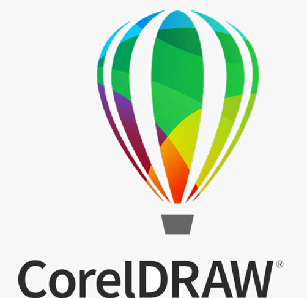

  <h1>Hi, I'm Victory
  
  </h1>

  
  

  

  
---
### :woman_technologist: About Me:

I am a Frontend developer and Graphics designer from Nigeria.

- :woman_student:I'm an undergraduate in the University of Lagos studying Systems Engineering.

- ⚡ Fun fact: I've reading novels, listening to music and watching movies in my free time.

- :mailbox:How to reach me: 

- :zap: In my free time, I'm into graphics design. [Check out some of what I've designed](https://drive.google.com/drive/folders/1lacD9ubol-Pe2tSJ1cP2UyhfKPCdXKZF)

- 💬 Ask me about anything🌚,

- 😄 Pronouns: She/Her,

- 🌱 I’m currently a Software Engineering student at alx_africa.

---
### :hammer_and_wrench: Languages

  &nbsp;
  &nbsp;
  &nbsp;
  &nbsp;
  &nbsp;
  &nbsp;
  &nbsp;
  

---
#### :hammer_and_wrench: Tools I Use

  &nbsp;
  &nbsp;
  

---

  

---

### :fire: My Stats :

<!--
  

&nbsp;
  
**preciousvictory/preciousvictory** is a ✨ _special_ ✨ repository because its `README.md` (this file) appears on your GitHub profile.

Here are some ideas to get you started:
👋
- 🔭 I’m currently working on ...

- 👯 I’m looking to collaborate on ...
- 🤔 I’m looking for help with ...
- 💬 Ask me about ...
- 📫 How to reach me: ...
- 😄 Pronouns: ...
-  ...
-->
